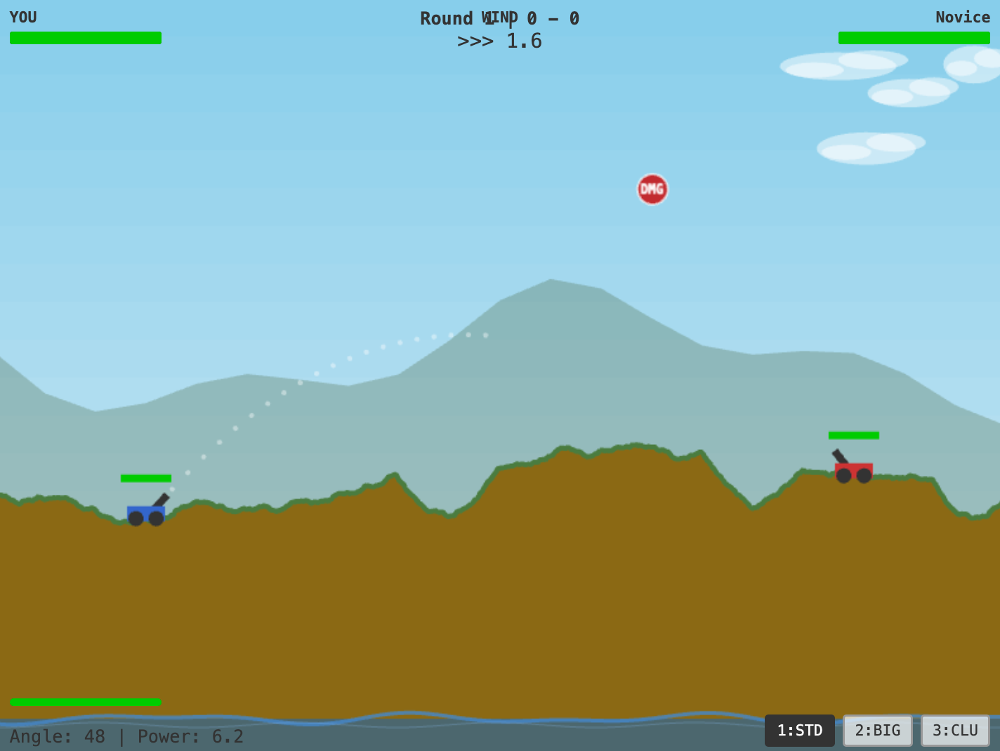

# Cannons

Real-time 2D artillery game. Fire projectiles across destructible terrain to destroy the enemy cannon before it destroys yours. Both sides fire independently -- no waiting for turns.



## Controls

| Key | Action |
|-----|--------|
| UP / DOWN | Adjust barrel angle |
| LEFT / RIGHT | Adjust power |
| SPACE | Fire (2s cooldown) |
| 1 / 2 / 3 | Switch weapon |

## Weapons

| # | Name | Blast | Damage | Notes |
|---|------|-------|--------|-------|
| 1 | Standard | 40px | 35 | Default, balanced |
| 2 | Big Blast | 70px | 20 | Larger crater, slower projectile |
| 3 | Cluster Bomb | 30px | 15 | Splits into 3 sub-projectiles |

## Gameplay

- Wind changes every 5 seconds, shown in HUD
- Terrain deforms on impact (sand = deeper craters, rock = resistant)
- Barrel hit reduces max power, wheel hit locks angle
- Power-ups drop every 15-20s: health, damage boost, shield
- Water at terrain floor is an instant kill
- Best of 5 rounds, terrain type and lighting change each round
- 3 AI difficulties: Easy, Medium, Hard (learns from misses)

## Quick Start

```
npm install
npm run dev
```

## Testing

```
npm run test              # unit tests (vitest)
npx playwright install chromium
npm run e2e               # e2e tests (playwright)
```

## Build and Deploy

```
npm run build             # vite production build
make run                  # build + preview locally
make docker-build         # docker image
make docker-run           # run in docker on port 8080
make help                 # list all targets
```

## Tech Stack

- React 18, Vite, Phaser 3, Matter.js
- Vitest, Playwright
- Procedural terrain (midpoint displacement)
- Procedural audio (Web Audio API oscillators + noise)

## License

GPL-3.0
